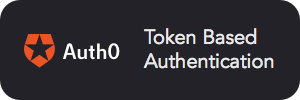

## Welcome to open source at the Texas Tribune

We'll fill in this space soon to highlight more of our projects but here's a few to get started:

- Our [pixel tracking tool](https://github.com/texastribune/dot) to help monitor republished articles
- Our [site/software](https://github.com/texastribune/donations) to help nonprofits collect donations
- A [flexible filesystem API](https://github.com/texastribune/donations) for use in the browser

### Supporters

Our work is genererously supported by [BrowserStack](https://www.browserstack.com) and [Auth0](https://auth0.com). BrowserStack helps us snuff out cross-browser issues before they reach the user. Additionally, the ability to test projects from `localhost` saves us lots of development time.

